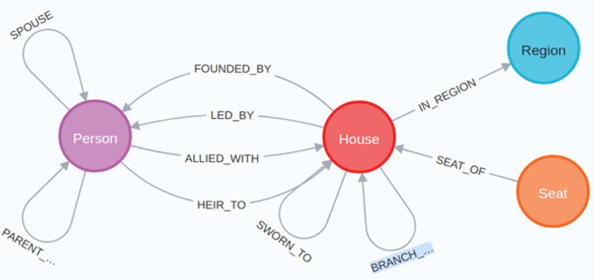

# Neo4j - Game of Thrones
Tutorial de con el código utilizado en el video explicatorio de Neo4j del canal de YouTube [Garaje de Ideas - Data](https://www.youtube.com/channel/UCGjEiZ2SOXS9wWnV5THKZFg).

A continuación se incluye el código necesario para montar e ingestar nuestra base de datos de grafos Neo4j con todos los personajes, casas y reinos de Juego de Tronos, así como las relaciones existentes entre estos, para que se pueda replicar el caso de uso planteado en el video. También se encuentran las queries planteadas en los ejercicios del final. No obstante, ¡os animo a que intentéis sacarlas vosotros antes de ver la solución!

El repositorio base original es el siguiente, por si también queréis echarle un ojo: https://github.com/neo4j-examples/game-of-thrones

Otros ejemplos de casos de uso con neo4j: https://github.com/neo4j-examples/neo4j-movies-python-neomodel


## Contenidos

1. [Carga de datos](#carga-de-datos)
2. [Creación de constraints](#creacion-de-constraints)
3. [Visualización del esquema de relaciones](#visualizacion-del-esquema-de-relaciones)
4. [Consultas de ejemplo](#consultas-de-ejemplo)
5. [Ejercicios finales](#ejercicios-finales)


## 1. Carga de datos <a name="carga-de-datos"></a>

Datos de personajes y sus relaciones correspondientes.

```sql
call apoc.load.jsonArray('https://raw.githubusercontent.com/joakimskoog/AnApiOfIceAndFire/master/data/characters.json') yield value
with apoc.convert.toMap(value) as data
with apoc.map.clean(data, [],['',[''],[],null]) as data
with apoc.map.fromPairs([k in keys(data) | [toLower(substring(k,0,1))+substring(k,1,size(k)), data[k]]]) as data
MERGE (p:Person {id:data.id})
SET
p += apoc.map.clean(data, ['allegiances','father','spouse','mother'],['',[''],[],null]),
p.name = coalesce(p.name,head(p.aliases))
FOREACH (id in data.allegiances | MERGE (h:House {id:id}) MERGE (p)-[:ALLIED_WITH]->(h))
FOREACH (id IN CASE WHEN data.father IS NOT NULL THEN [data.father] ELSE [] END |
    MERGE (o:Person {id:id})
    MERGE (o)-[:PARENT_OF {type:'father'}]->(p)
)
FOREACH (id IN CASE WHEN data.mother IS NOT NULL THEN [data.mother] ELSE [] END |
    MERGE (o:Person {id:id})
    MERGE (o)-[:PARENT_OF {type:'mother'}]->(p)
)
FOREACH (id IN CASE WHEN data.spouse IS NOT NULL THEN [data.spouse] ELSE [] END |
    MERGE (o:Person {id:id})
    MERGE (o)-[:SPOUSE]->(p)
)
return p.id, p.name;
```

Datos de casas y sus relaciones correspondientes.

```sql
call apoc.load.jsonArray('https://raw.githubusercontent.com/joakimskoog/AnApiOfIceAndFire/master/data/houses.json') yield value
with apoc.convert.toMap(value) as data
with apoc.map.clean(data, [],['',[''],[],null]) as data
with apoc.map.fromPairs([k in keys(data) | [toLower(substring(k,0,1))+substring(k,1,size(k)), data[k]]]) as data
MERGE (h:House {id:data.id})
SET
h += apoc.map.clean(data, ['overlord','swornMembers','currentLord','heir','founder','cadetBranches'],['',[''],[],null])
FOREACH (id in data.swornMembers | MERGE (o:Person {id:id}) MERGE (o)-[:ALLIED_WITH]->(h))
FOREACH (s in data.seats | MERGE (seat:Seat {name:s}) MERGE (seat)-[:SEAT_OF]->(h))
FOREACH (id in data.cadetBranches | MERGE (b:House {id:id}) MERGE (b)-[:BRANCH_OF]->(h))
FOREACH (id IN CASE WHEN data.overlord IS NOT NULL THEN [data.overlord] ELSE [] END |
    MERGE (o:House {id:id})
    MERGE (h)-[:SWORN_TO]->(o)
)
FOREACH (id IN CASE WHEN data.currentLord IS NOT NULL THEN [data.currentLord] ELSE [] END |
    MERGE (o:Person {id:id})
    MERGE (h)-[:LED_BY]->(o)
)
FOREACH (id IN CASE WHEN data.founder IS NOT NULL THEN [data.founder] ELSE [] END |
    MERGE (o:Person {id:id})
    MERGE (h)-[:FOUNDED_BY]->(o)
)
FOREACH (id IN CASE WHEN data.heir IS NOT NULL THEN [data.heir] ELSE [] END |
    MERGE (o:Person {id:id})
    MERGE (o)-[:HEIR_TO]->(h)
)
FOREACH (id IN CASE WHEN data.region IS NOT NULL THEN [data.region] ELSE [] END |
    MERGE (o:Region {id:id})
    MERGE (h)-[:IN_REGION]->(o)
)
return h.id, h.name;
```

## 2. Creación de índices y constraints <a name="#creacion-de-constraints"></a>

```sql
CREATE CONSTRAINT FOR (p:Person) require p.id is unique;
CREATE CONSTRAINT FOR (h:House) require h.id is unique;
CREATE INDEX FOR (p:Person) ON (p.name);
CREATE INDEX FOR (h:House) ON (h.name);
CREATE INDEX FOR (s:Seat) ON (s.name);
CREATE INDEX FOR (r:Region) ON (r.name);

```

## 3. Visualización del esquema de relaciones <a name="#visualizacion-del-esquema-de-relaciones"></a>

```sql
CALL db.schema.visualization()
```




## 4. Consultas de ejemplo <a name="#consultas-de-ejemplo"></a>

### 4.1 Ver las personas existentes

```sql
MATCH (p1:Person)
RETURN p1;
```

### 4.1 Ver personas y filtrar por un atributo

```sql
MATCH (p1:Person)
WHERE p1.isFemale = true
RETURN p1;
```

### 4.2 Contar

```sql
MATCH (n:Region)
RETURN count(n) AS totalRegiones
```

### 4.3 Filtrar en base a una relación

```sql
MATCH (p:Person)-[ally:ALLIED_WITH]->(house:House {name: 'House Stark of Winterfell'})
RETURN p, house, ally;
```

### 4.4 Consulta de relaciones más complejas

```sql
MATCH (grandParent:Person)-[:PARENT_OF]->(fatherOrMother)-[:PARENT_OF]->(sonOrDaughter:Person)
RETURN grandParent.name, fatherOrMother.name, sonOrDaughter.name;
```

### 4.5 Agrupación y conteo

```sql
MATCH (p:Person)-[:ALLIED_WITH]->(house)
RETURN house.name, count(p) as members
ORDER BY members DESC LIMIT 5;
```

### 4.6 Consulta con WITH y WHERE

```sql
MATCH (p:Person)-[:PARENT_OF]->(child)
WITH p, count(child) AS children
WHERE children > 2
RETURN p.name, children;
```

### 4.7 Creación de un nuevo nodo en base a un atributo

Vemos que atributos tiene una casa:

```sql
MATCH (h:House)
RETURN h LIMIT 1;
```

Creamos relaciones entre los nodos House y sus armas ancestrales:

```sql
MATCH (h:House)
WHERE h.ancestralWeapons IS NOT NULL
FOREACH (weapon IN h.ancestralWeapons |
    MERGE (a:AncestralWeapon {name: weapon})
    MERGE (h)-[:HAS_WEAPON]->(a)
)
```

Revisamos la nueva relacion:

```sql
MATCH p=()-[:HAS_WEAPON]->() RETURN p;
```

Eliminamos los nuevos nodos que acabamos de crear:

```sql
MATCH (aw:AncestralWeapon)
DETACH DELETE aw;
```

## 5. Ejercicios finales <a name="#ejercicios-finales"></a>

Número actual de casas y el número actual de personas que son fieles a la casa “House Stark of Winterfell”, en una única fila

```sql
MATCH (h:House)-[:SWORN_TO]->(e:House)
WHERE e.name = 'House Stark of Winterfell'
WITH count(h) as numberSwornHouses
MATCH (p:Person)-[:ALLIED_WITH]->(e:House)
WHERE e.name = 'House Stark of Winterfell'
WITH numberSwornHouses, count(p) as numberAlliedPersons
RETURN numberSwornHouses, numberAlliedPersons
```

Personas que heredarán el gobierno de su casa y que no están casadas. Queremos que se muestre en la query:
- el nombre de la casa
- el nombre de la persona heredera
- la cantidad de casas fieles
- un campo de nombre “gender” que presentará el valor “Mujer” si se trata de una heredera o “Hombre” si se trata de un heredero
Queremos solo los 4 registros con más casas fieles 


```sql
MATCH (p: Person)- [:HEIR_TO] -> (h:House)
WHERE NOT EXISTS((p)-[:SPOUSE]-()) AND NOT EXISTS(() -[:SPOUSE]-(p))
MATCH (hs:House)-[:SWORN_TO]->(ht:House)
WHERE h = ht
WITH p, h, count(hs) as numLoyalhouses
RETURN h.name as houseName,
    p.name as heir,
    numLoyalhouses,
    CASE
        WHEN p.isFemale = true THEN 'Mujer'
        ELSE 'Hombre'
    END AS gender
ORDER BY numLoyalhouses DESC 
LIMIT 4
```